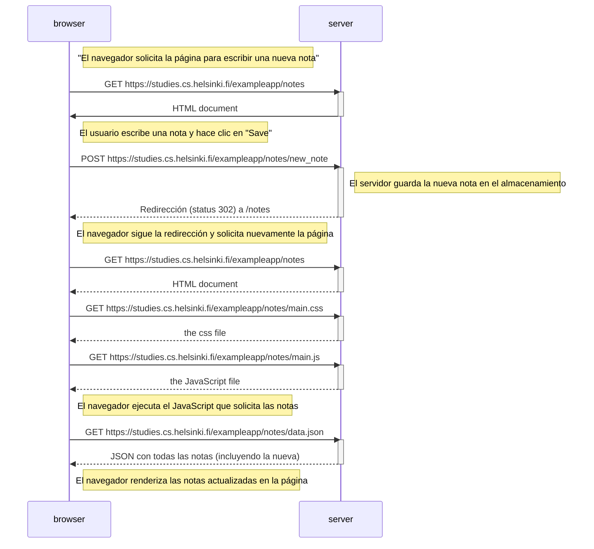

# Diagrama de Secuencia - Crear una Nueva Nota

```mermaid
sequenceDiagram
    participant browser
    participant server

    Note right of browser: "El navegador solicita la página para escribir una nueva nota"
    browser->>server: GET https://studies.cs.helsinki.fi/exampleapp/notes
    activate server

    server->>browser: HTML document
    deactivate server

    Note right of browser: El usuario escribe una nota y hace clic en "Save"

    browser->>server: POST https://studies.cs.helsinki.fi/exampleapp/notes/new_note
    activate server
    Note right of server: El servidor guarda la nueva nota en el almacenamiento
    server-->>browser: Redirección (status 302) a /notes
    deactivate server

    Note right of browser: El navegador sigue la redirección y solicita nuevamente la página

    browser->>server: GET https://studies.cs.helsinki.fi/exampleapp/notes
    activate server
    server-->>browser: HTML document
    deactivate server

    browser->>server: GET https://studies.cs.helsinki.fi/exampleapp/notes/main.css
    activate server
    server-->>browser: the css file
    deactivate server

    browser->>server: GET https://studies.cs.helsinki.fi/exampleapp/notes/main.js
    activate server
    server-->>browser: the JavaScript file
    deactivate server

    Note right of browser: El navegador ejecuta el JavaScript que solicita las notas

    browser->>server: GET https://studies.cs.helsinki.fi/exampleapp/notes/data.json
    activate server
    server-->>browser: JSON con todas las notas (incluyendo la nueva)
    deactivate server

    Note right of browser: El navegador renderiza las notas actualizadas en la página
```
