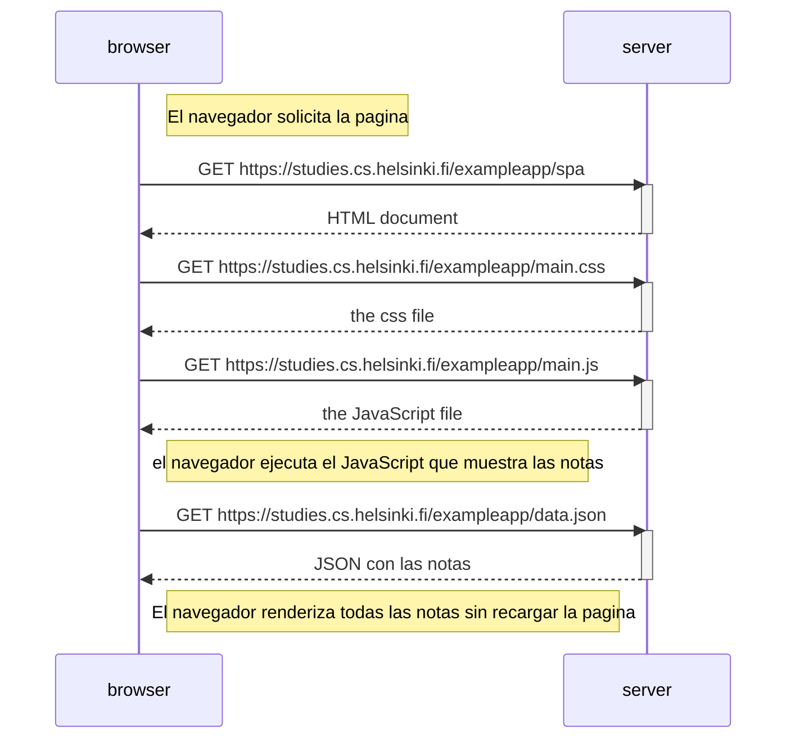

# Ejercicio 0.5

```mermaid
  sequenceDiagram
          participant browser
          participant server

    Note right of browser: El navegador solicita la pagina

    browser ->> server: GET https://studies.cs.helsinki.fi/exampleapp/spa
    activate server
    server -->> browser: HTML document
    deactivate server

    browser ->> server: GET https://studies.cs.helsinki.fi/exampleapp/main.css
    activate server
    server -->> browser: the css file
    deactivate server

    browser ->> server: GET https://studies.cs.helsinki.fi/exampleapp/main.js
    activate server
    server -->> browser: the JavaScript file
    deactivate server

    Note right of browser: el navegador ejecuta el JavaScript que muestra las notas

    browser ->> server: GET https://studies.cs.helsinki.fi/exampleapp/data.json
    activate server
    server -->> browser: JSON con las notas
    deactivate server

    Note right of browser: El navegador renderiza todas las notas sin recargar la pagina
```
