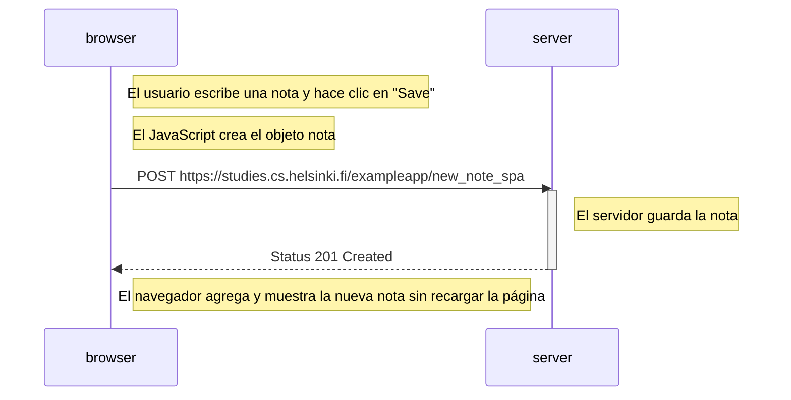

# Ejercicio 0.6.md

```mermaid
sequenceDiagram
    participant browser
    participant server

    Note right of browser: El usuario escribe una nota y hace clic en "Save"

    Note right of browser: El JavaScript crea el objeto nota

    browser->>server: POST https://studies.cs.helsinki.fi/exampleapp/new_note_spa
    activate server

    Note right of server: El servidor guarda la nota
    
    server-->>browser: Status 201 Created
    deactivate server

    Note right of browser: El navegador agrega y muestra la nueva nota sin recargar la página

```